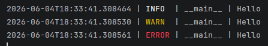
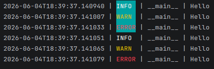
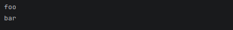
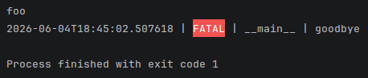
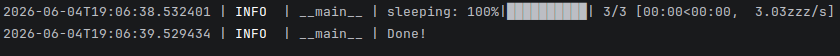
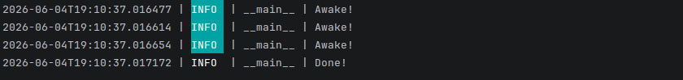

<div style="display: flex; align-items: center;">
  
  <h1 style="margin: 0;">Loggy: Personal Logging and Utilities Python Library</h1>
</div>

> Feel free to use it or don't, this saves me time copy-pasting the same code between projects. There are many like it,
> but this one is mine.

## Features

- `INFO`, `DEBUG`, or automatic silent mode
- `tqdm` loading bar support for async, threaded, or manual increments
- Record objects for storing logs
- Misc. util objects like timers

## Installation

```bash
pip install git+https://github.com/dlg1206/loggy.git
```

or add to `requirements.txt`

```txt
loggy @ git+https://github.com/dlg1206/loggy.git
```

## Basic Usage

### `INFO` mode

```python
import loggy

loggy.info("Hello")
loggy.warn("Hello")
loggy.error("Hello")
```



### `DEBUG` mode

```python
import loggy
from loggy import Level

loggy.set_log_level(Level.DEBUG)

loggy.debug_info("Hello")
loggy.debug_warn("Hello")
loggy.debug_error("Hello")
loggy.info("Hello")
loggy.warn("Hello")
loggy.error("Hello")
```



### `SILENT` mode

> All loggy output is silenced

```python
import loggy

loggy.set_log_level(None)

print("foo")
loggy.debug_info("Hello")
loggy.debug_warn("Hello")
loggy.debug_error("Hello")
loggy.info("Hello")
loggy.warn("Hello")
loggy.error("Hello")
print("bar")
```



### `Fatal`

> Program immediately exits with a non-zero code

```python
import loggy

print("foo")
loggy.fatal("goodbye")
print("bar")
```



### Async / Threaded / Manual Loading Bars

> Concept is the same with async, just replace futures with coroutines

#### `INFO` Mode

```python
import time
from concurrent.futures import ThreadPoolExecutor

import loggy


def sleep() -> str:
    time.sleep(1)
    return "Awake!"


with ThreadPoolExecutor() as exe:
    futures = [exe.submit(sleep) for _ in range(3)]

    for f in loggy.threaded_data_queue(futures, description="sleeping", unit="zzz"):
        result = f.result()
        # do extra processing here
        loggy.debug_info(result)

loggy.info("Done!")
```



#### `DEBUG` Mode

```python
import time
from concurrent.futures import ThreadPoolExecutor

import loggy
from loggy import Level

loggy.set_log_level(Level.DEBUG)  # <-- Set mode to debug


def sleep() -> str:
    time.sleep(1)
    return "Awake!"


with ThreadPoolExecutor() as exe:
    futures = [exe.submit(sleep) for _ in range(3)]

    for f in loggy.threaded_data_queue(futures, description="sleeping", unit="zzz"):
        result = f.result()
        # do extra processing here
        loggy.debug_info(result)

loggy.info("Done!")
```

